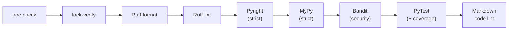
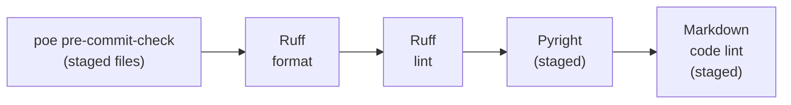
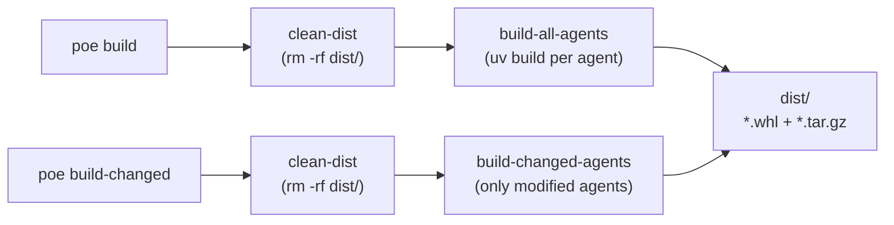
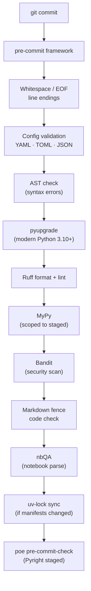
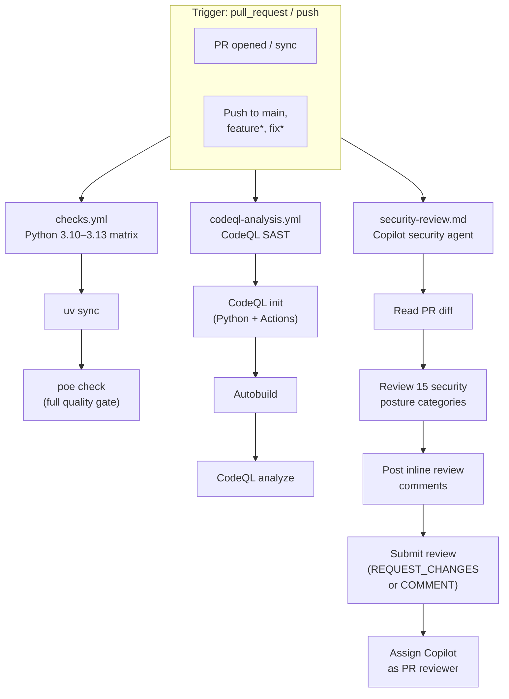
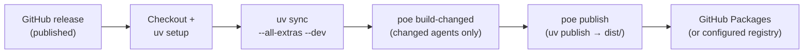
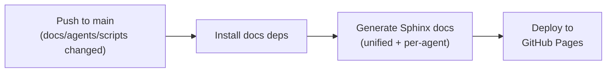
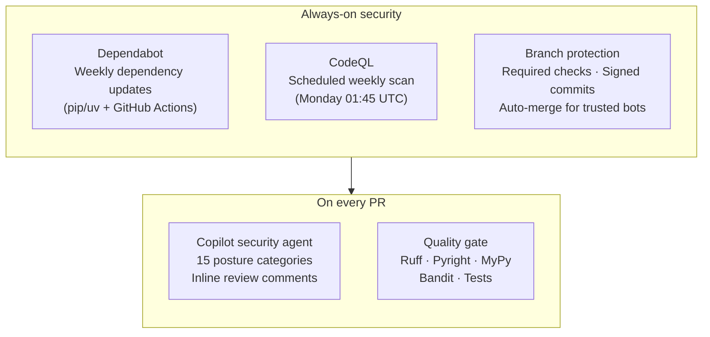

# python-agent-template

A security-first monorepo template for building, testing, and shipping Python agents — or any AI-generated / "vibe coded" project that needs production-grade guardrails from day one.

Whether you are building LLM agents, automation bots, or any Python package, this template gives you a batteries-included starting point: strict typing, multi-layer security scanning, automated CI/CD, and a release pipeline — so you can focus on your code while the guardrails catch mistakes before they reach production.

> **Disclaimer:** Derived from the [Microsoft Agent Framework](https://github.com/microsoft/agent-framework) for learning and acceleration. Evaluate and adapt to your organization's security, compliance, and coding standards before production use.

---

## Why this template?

AI code assistants and vibe coding accelerate development but can introduce subtle bugs, security issues, and type errors. This template wraps every code change in **six layers of automated checks** — from your editor to production — so generated code gets the same scrutiny as hand-written code.

```mermaid
flowchart TB
    subgraph L1["1. Editor"]
        direction LR
        E1[Pylance type checking]
        E2[Ruff auto-format on save]
        E3[Copilot custom instructions]
    end

    subgraph L2["2. Pre-commit hooks"]
        direction LR
        H1[Ruff format + lint]
        H2[MyPy scoped]
        H3[Bandit security]
        H4[Whitespace / EOF / config checks]
        H5[Markdown fence lint]
        H6[uv-lock sync]
    end

    subgraph L3["3. CI -  Quality gate"]
        direction LR
        C1["Ruff format + lint"]
        C2[Pyright strict]
        C3[MyPy strict]
        C4[Bandit]
        C5[PyTest + coverage]
        C6[Markdown code lint]
    end

    subgraph L4["4. CI - Security Scanning"]
        direction LR
        S1[CodeQL — SAST for Python + Actions]
        S2[Dependabot — dependency updates]
        S3[Copilot security review agent — 15 posture categories]
    end

    subgraph L5["5. Copilot Review"]
        direction LR
        CR1[Copilot code review — assigned automatically]
        CR2[AI-powered suggestions and comments]
    end

    subgraph L6["6. Release"]
        direction LR
        R1[Build changed agents only]
        R2[Publish to GitHub Packages]
    end

    L1 --> L2
    L2 --> L3
    L3 --> L4
    L4 --> L5
    L5 --> L6
```



Each layer catches different classes of issues:

| Layer | When it runs | What it catches |
| --- | --- | --- |
| **Editor** | As you type | Type errors, formatting, AI-aware context via custom instructions |
| **Pre-commit** | On `git commit` (staged files) | Style drift, security anti-patterns, broken configs, stale lockfiles |
| **CI quality gate** | On PR / push | Full repo-wide type safety, test regressions, code quality |
| **CI security** | On PR / push / schedule | Dataflow vulnerabilities, outdated dependencies, security posture gaps |
| **Copilot Review** | On PR (after security scan) | AI-powered code review with suggestions and inline comments |
| **Release** | On GitHub release | Builds and publishes only changed agents to the package registry |

---

## Getting started

### Prerequisites

- Python 3.10–3.13 (3.13 recommended).
- [uv](https://docs.astral.sh/uv/) for environment and dependency management.
- Git for version control and hooks.

### Quick setup

```sh
# 1. Install uv
curl -LsSf https://astral.sh/uv/install.sh | sh

# 2. Clone and set up
git clone <your-repo-url> && cd <repo>
uv run poe setup

# 3. Run the full quality gate
uv run poe check
```

`poe setup` creates `.venv/`, installs all dev dependencies, and installs pre-commit hooks. `poe check` runs the full quality gate (format, lint, type checks, security, tests, markdown lint) across the entire workspace.

---

## Repository layout

```
Repo root
├─ .github/                                    # GitHub configuration and automation
│  ├─ workflows/                               # GitHub Actions workflows
│  │  ├─ checks.yml                            # lint, type-check, test on PRs and pushes
│  │  ├─ docs.yml                              # build Sphinx docs, deploy to GitHub Pages
│  │  ├─ release.yml                           # build and publish packages
│  │  ├─ codeql-analysis.yml                   # CodeQL security scanning
│  │  ├─ security-review.md                    # agentic workflow (security review)
│  │  └─ security-review.lock.yml              # compiled agentic workflow (generated)
│  ├─ agents/                                  # Copilot custom agents (*.agent.md)
│  │  ├─ security-reviewer.agent.md            # security reviewer agent
│  │  └─ agentic-workflows.agent.md            # dispatcher agent (gh aw init)
│  ├─ instructions/                            # Copilot custom instructions
│  │  ├─ python.instructions.md                # Python coding conventions
│  │  ├─ agents.instructions.md                # agent development guidelines
│  │  ├─ docs.instructions.md                  # documentation conventions
│  │  ├─ agentic-workflows.instructions.md     # agentic workflow authoring
│  │  └─ copilot-agents.instructions.md        # Copilot agent file format
│  ├─ ISSUE_TEMPLATE/                          # issue templates (bug, feature)
│  ├─ pull_request_template.md                 # PR template
│  ├─ dependabot.yml                           # Dependabot config
│  ├─ copilot-instructions.md                  # global Copilot instructions
│  └─ aw/                                      # agentic workflow lock data (generated)
├─ agents/
│  └─ <agent>/
│     ├─ src/<project>/agents/<agent>/         # agent code
│     ├─ tests/                                # agent tests
│     ├─ docs/source/                          # Sphinx sources
│     ├─ Dockerfile                            # container image
│     ├─ pyproject.toml                        # agent config, deps, version
│     └─ LICENSE                               # agent-specific license
├─ docs/                                       # unified Sphinx sources + output
├─ scripts/                                    # shared helpers for tasks/CI
├─ pyproject.toml                              # root config, deps, poe tasks
├─ shared_tasks.toml                           # poe tasks shared by all agents
└─ .pre-commit-config.yaml                     # pre-commit hook definitions
```

### Scripts (`scripts/`)

| Script | Purpose |
| --- | --- |
| `run_tasks_in_agents_if_exists.py` | Fans out a Poe task (fmt, lint, build, ...) to every agent that defines it |
| `run_tasks_in_changed_agents.py` | Same, but only for agents with changed files — used by `build-changed` and CI |
| `check_md_code_blocks.py` | Validates Python code blocks in markdown files |
| `generate_docs.py` | Builds unified and per-agent Sphinx documentation |

---

## Quality gates in detail

### Poe tasks — your single entry point

All quality checks, builds, and operations are accessed through [Poe the Poet](https://poethepoet.natn.io/) tasks. Run `uv run poe <task>` from the repo root.

#### `poe check` — full quality gate

Runs the complete quality pipeline sequentially. Use before pushing or merging.



#### `poe pre-commit-check` — fast staged-only checks

Runs a subset of checks scoped to staged files. Triggered automatically by pre-commit hooks.



#### `poe build` and `poe build-changed` — build pipeline



### Pre-commit hooks — on every `git commit`

Installed via `poe setup` (or `poe pre-commit-install`). Runs on staged files only for speed.



### CI workflows — on every PR and push



### Release workflow — on GitHub release



### Docs workflow — on push to main



### Continuous security — always-on protection



---

## Task reference

### Setup tasks

| Task | What it does |
| --- | --- |
| `poe setup` | Create `.venv/`, install deps, install pre-commit hooks |
| `poe venv` | Create/refresh `.venv/` (default Python 3.13, override with `-p`) |
| `poe install` | `uv sync --all-extras --dev` (docs group excluded) |
| `poe pre-commit-install` | Install pre-commit hooks into `.git/hooks` |

### Quality tasks

| Task | What it does |
| --- | --- |
| `poe fmt` | Ruff format (Black-like, 120-col, import sorting) |
| `poe lint` | Ruff lint (pycodestyle, pyflakes, bugbear, pylint, Bandit rules, ...) |
| `poe pyright` | Pyright strict type checking |
| `poe mypy` | MyPy strict type checking (+ pydantic plugin) |
| `poe bandit` | Bandit security scan (fans out to agents + scripts) |
| `poe test` | PyTest + coverage across all agents |
| `poe markdown-code-lint` | Lint Python code blocks in markdown files |
| `poe check` | Full quality gate: all of the above in sequence |
| `poe pre-commit-check` | Fast staged-only subset (fmt, lint, pyright, markdown lint) |

### Build and publish tasks

| Task | What it does |
| --- | --- |
| `poe clean-dist` | Remove `dist/` directory |
| `poe build` | Clean dist, then build **all** agent packages |
| `poe build-changed` | Clean dist, then build only **changed** agent packages |
| `poe publish` | Upload everything in `dist/` to the package registry |

### Documentation tasks

| Task | What it does |
| --- | --- |
| `poe docs-install` | Install Sphinx and documentation dependencies |
| `poe docs` | Build unified + per-agent documentation |

---

## Using this template

### Step 1: Create a new agent

```sh
# Copy the template agent
cp -r agents/agent1 agents/<your-agent>
```

### Step 2: Configure the agent

Edit `agents/<your-agent>/pyproject.toml`:
- Update `name`, `description`, `version`, and `urls`.
- Adjust `tool.flit.module` to match the agent's namespace.
- Add agent-specific dependencies.

### Step 3: Implement and test

- Write code under `agents/<your-agent>/src/<project>/agents/<your-agent>/`.
- Write tests under `agents/<your-agent>/tests/`.
- Run checks: `uv run poe -C agents/<your-agent> check` or `uv run poe check` from root.

### Step 4: Run the agent

```sh
# From agent directory
uv run <your-agent> [args]

# From workspace root
uv run --package <your-agent> <your-agent> [args]
```

### Step 5: Release

1. Bump the version in `agents/<your-agent>/pyproject.toml`.
2. Merge to main.
3. Create a GitHub release — the release workflow builds and publishes automatically.

---

## Build, publish, and release

Each agent is an independent package with its own version, enabling independent SDLC lifecycles. All build artifacts land in the workspace root `dist/` directory.

- `poe build` — cleans `dist/` and builds **all** agent packages.
- `poe build-changed` — cleans `dist/` and builds only agents with **changed files**.
- `poe publish` — uploads everything in `dist/`. The registry rejects duplicate versions, so only agents with bumped versions actually get uploaded.

The [release workflow](.github/workflows/release.yml) runs on GitHub release events and `workflow_dispatch`. It uses `build-changed` → `publish` so only modified agents are built and published.

### Changing the publish target

By default, packages are published to **GitHub Packages**. To publish to a different registry (PyPI, Artifactory, Azure Artifacts, etc.), update two places:

1. **`pyproject.toml`** — update the `[[tool.uv.index]]` section:

   ```toml
   [[tool.uv.index]]
   name = "pypi"               # or your registry name
   url = "https://pypi.org/simple/"
   publish-url = "https://upload.pypi.org/legacy/"
   explicit = true
   ```

2. **`.github/workflows/release.yml`** — update the publish step environment variables:

   ```yaml
   - name: Publish to PyPI
     env:
       UV_PUBLISH_URL: https://upload.pypi.org/legacy/
       UV_PUBLISH_TOKEN: ${{ secrets.PYPI_TOKEN }}
     run: uv run poe publish
   ```

   For PyPI, create an API token and store it as a repository secret (`PYPI_TOKEN`). For GitHub Packages, the built-in `GITHUB_TOKEN` is used automatically.

---

## What the checks catch

### Ruff (format + lint)

- **Format:** Black-like formatter, import sorting, 120-col width, normalized strings/spacing.
- **Lint families:** pycodestyle (E/W), pyflakes (F), bugbear (B), pyupgrade (UP), pylint (PLC/PLE/PLR/PLW), Bandit (S), pytest (PT), return rules (RET), async (ASYNC), datetime (TZ), ISC, SIM, quotes (Q), exceptions (TRY), todos (TD/FIX), naming (N), docstyle (D, Google convention), imports (ICN/I), pydantic (PGH), debugger (T100).
- **Relaxations:** tests allow `assert` (`S101`) and magic numbers (`PLR2004`); notebooks skip copyright and long-line checks.

### Pyright (strict)

- Covers `agents/` and `scripts/`, strict mode, unused imports reported.
- Catches: incorrect signatures, bad attribute access, incompatible unions/Optionals, missing imports, unreachable code, missing type annotations, unsafe narrowing.

### MyPy (strict)

- Covers `agents/` and `scripts/`, strict + pydantic plugin.
- Catches: type mismatches, Optional misuse, protocol violations, missing annotations, decorator typing gaps.

> **Why both Pyright and MyPy?** They use different inference engines and plugin ecosystems. Running both raises signal and lowers the chance of missing type errors — critical when working with AI-generated code.

---

## Agentic workflows

The repository includes a [GitHub Agentic Workflow](https://github.github.com/gh-aw/) that automates security review on every pull request.

### Security review agent

A Copilot custom agent defined in [`.github/agents/security-reviewer.agent.md`](.github/agents/security-reviewer.agent.md) contains the security review prompt — 15 security posture categories (input validation, secrets, subprocess safety, network security, authentication, logging hygiene, error handling, dependency security, file system safety, cryptography, configuration, concurrency, container security, CI/CD, and test coverage) with detailed checklists for each.

### Security review workflow

The agentic workflow at [`.github/workflows/security-review.md`](.github/workflows/security-review.md) imports the security review agent and runs on every `pull_request` event (`opened`, `synchronize`). It:

1. Reads the pull request diff.
2. Reviews changed files against all 15 security posture categories.
3. Posts inline review comments on specific code lines where issues are found.
4. Submits a consolidated review (`REQUEST_CHANGES` for critical/high, `COMMENT` otherwise).
5. Requests Copilot as a reviewer for additional code quality coverage.

### Compiling agentic workflows

Agentic workflow `.md` files must be compiled into GitHub Actions `.lock.yml` files before they can run:

```bash
# Install the extension (once)
gh extension install github/gh-aw

# Compile all workflows (generates .github/workflows/*.lock.yml)
gh aw compile

# Compile a specific workflow
gh aw compile security-review
```

Commit both the `.md` source and the generated `.lock.yml` file. Only frontmatter changes require recompilation — edits to the markdown body take effect at runtime without recompiling.

Configure a `COPILOT_GITHUB_TOKEN` secret in your repository settings (Settings → Secrets and variables → Actions). See the [gh-aw authorization docs](https://github.github.com/gh-aw/reference/auth/) for details.

### Copilot custom instructions

The `.github/instructions/` directory contains context-aware instructions that guide Copilot when editing specific file types:

| File | Applies to | Purpose |
| --- | --- | --- |
| `python.instructions.md` | `**/*.{py,ipynb}` | Python coding conventions, typing, docstrings |
| `agents.instructions.md` | `agents/**/*` | Agent development guidelines and namespace rules |
| `docs.instructions.md` | `docs/**/*`, `agents/*/docs/**/*` | Documentation conventions |
| `agentic-workflows.instructions.md` | `.github/workflows/*.md` | Agentic workflow authoring rules |
| `copilot-agents.instructions.md` | `.github/agents/*.agent.md` | Agent file format and naming conventions |

---

## Documentation

Documentation is built using Sphinx and published to GitHub Pages via the [docs workflow](.github/workflows/docs.yml).

```sh
# Install docs dependencies
uv run poe docs-install

# Build locally
uv run poe docs
```

The docs workflow triggers on pushes to `main` when documentation sources, agent source code, or the docs generation script change.

> **Note:** `docs/generated/` and `agents/*/docs/generated/` are produced by CI; do not edit or commit them.

---

## Security and automation

| Mechanism | What it does | Why it matters |
| --- | --- | --- |
| **Dependabot** | Weekly updates for pip/uv dependencies and GitHub Actions | Shrinks vulnerability exposure windows |
| **CodeQL** | SAST/code scanning for Python and GitHub Actions | Finds dataflow and security issues beyond linters |
| **Copilot security agent** | AI-powered reviews against 15 security posture categories | Catches issues that static analysis misses |
| **Branch protection** | Required checks, signed commits, auto-merge for trusted bots | Prevents unverified code from reaching main |
| **Pre-commit hooks** | Staged-file checks before every commit | Catches issues at the earliest possible point |
| **Dual type checkers** | Pyright + MyPy with different inference engines | Maximal type safety for AI-generated code |

---

## Tooling reference

### Local + CI tools

| Tool | Where | What it does | Docs |
| --- | --- | --- | --- |
| uv | Local + CI | Fast Python installer/resolver, reproducible envs | [uv docs](https://docs.astral.sh/uv/) |
| Poe the Poet | Local + CI | Task runner, fan-out to agents | [Poe docs](https://poethepoet.natn.io/) |
| Ruff | Local + CI | Format + lint (single fast tool) | [Ruff docs](https://docs.astral.sh/ruff/) |
| Pyright | Local + CI | Strict static type checker | [Pyright docs](https://microsoft.github.io/pyright/) |
| MyPy | Local + CI | Strict type checker + pydantic plugin | [MyPy docs](https://mypy.readthedocs.io/en/stable/) |
| Bandit | Local + CI | Python security static analysis | [Bandit docs](https://bandit.readthedocs.io/en/latest/) |
| PyTest | Local + CI | Tests + coverage | [PyTest docs](https://docs.pytest.org/en/latest/) |
| pre-commit | Local | Hook framework for staged-file checks | [pre-commit docs](https://pre-commit.com/) |

### GitHub-hosted automation

| Service | What it does | Docs |
| --- | --- | --- |
| CodeQL Analysis | Code scanning for Python and GitHub Actions | [CodeQL docs](https://docs.github.com/code-security/code-scanning) |
| Dependabot | Weekly dependency and Actions updates | [Dependabot docs](https://docs.github.com/code-security/dependabot) |
| Copilot security review | Agentic AI security review on PRs | [gh-aw docs](https://github.github.com/gh-aw/) |

---

## Virtualenv setup and cleanup

```sh
# Create fresh env and install everything
uv run poe setup

# Specify a Python version
uv run poe setup --python 3.12

# Manual fallback
uv venv --python 3.13 && uv sync --all-extras --dev

# Clean everything
rm -rf .venv .pytest_cache .ruff_cache .mypy_cache __pycache__ \
  agents/**/{.pytest_cache,.ruff_cache,.mypy_cache,__pycache__}
```

## Copyright option

Ruff copyright enforcement is available but disabled. If your org requires it, enable the `flake8-copyright` block in `pyproject.toml` and add headers. Leave it off to avoid breaking contributions until ready.
